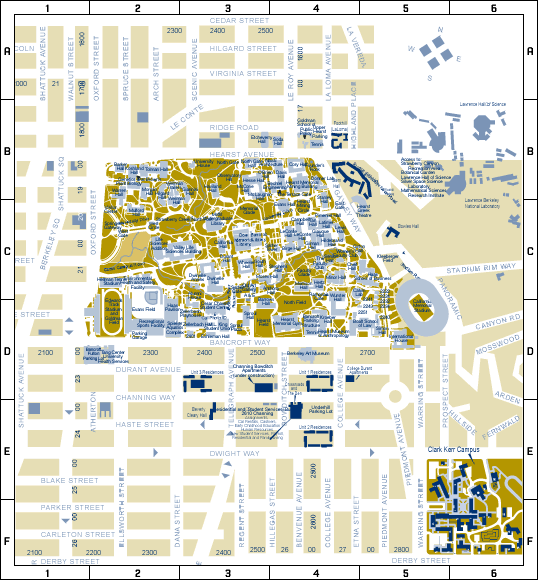

# The Persson Group Handbook

This website serves as the group handbook for the [Persson Group](http://perssongroup.lbl.gov) at the University of California, Berkeley / Lawrence Berkeley National Laboratory. The handbook contains useful information for new students and post-docs joining the group, and has answers to many frequently asked questions. You are encouraged to contribute to this handbook via the [open-source repo.](http://perssongroup.lbl.gov)

## Table of Contents

#### [About the Group](#about)

#### [Before You Arrive](#before)

#### [After You Arrive](#after)

#### [Getting situated in your office](#office)

#### [Food and Coffee](#foodandcoffe)

#### [Mail and Fax](#mailnfax)

#### [Equipment and Conference Rooms](#conferencerooms)

#### [Sick Policy](#sick)

#### [Time Reporting and LETS](#lets)

#### [Miscellaneous Issues](#miscissues)

#### [Other Issues](#stress)

#### [Purchases](#money)

#### [Conference Travel](#travel)

#### [Meetings](#meeting)

* [Group Meeting](#group)

* [Subgroup Meetings](#sub)

#### [Subgroups](#sgs)

#### [Information for Postdocs](#postdocs)

* [Postdoc Union](#union)

* [Vacation Policy](#vacay)

#### [Information for Graduate Students](#students)

* [Students Coming from Another State/Country](#slr)

-----------------------------------------------------------------------------------------------------------------------------
&nbsp;

## About the Group 

Our group studies the physics and chemistry of materials using atomistic computational methods and high-performance computing technology. Most of our research is focused on materials for energy applications, such as battery electrode materials, electrolytes, photocatalysts, thermoelectrics, etc. We are co-located at Lawrence Berkeley National Laboratory (LBNL) and the University of California, Berkeley, just down the hill from LBNL. Our main workspaces are located at LBNL, but we have a number of additional desks available on campus for students to use in between classes, which are located in the grad bay of Hearst Memorial Mining Building. San Francisco is located across the bay from Berkeley and is about a 30 minute drive or BART train ride away. Berkeley itself is a vibrant city of 115,000 people filled with cafes, restaurants of all types, and cultural activities.

-----------------------------------------------------------------------------------------------------------------------------

## Before You Arrive 

Although many things can only be taken care of after arriving at LBNL, here are a few simple things you should do in advance.

  
  

     
    

      <h3 padding-top="20" padding-left="20" >Join Slack</h3>
    

      Slack is a messaging app that we use extensively to communicate both within our group and with our Materials Project collaborators. To join our <a href="https://berkeleytheory.slack.com"> slack channel </a>, you'll need to use your @lbl.gov email address.
          
    

  

   

 
  

    <h3 padding-top="20" padding-left="20">Order a Computer</h3>
      

    Postdocs and graduate students - let’s order your workstation in advance so that it’s ready by the time you arrive.
How? See purchasing a computer.
             
    

  

   

  

     
    

      <h3 padding-top="10" padding-left="20">Find a place to live</h3>
    

      Berkeley and the surrounding areas are wonderful places to live, but finding an apartment can be difficult and is best done with knowledge of the various neighborhoods. How? See looking for housing.
          
    

  

&nbsp;
-----------------------------------------------------------------------------------------------------------------------------
&nbsp;

## After You Arrive 
Welcome to Berkeley! Here is a checklist of things you should complete within your first week:

* Set up your computer. See [SETTING UP YOUR COMPUTER]() on how to do this and some recommended software to install.
* Complete the checklist that HR gives you in your welcome package. Note: postdocs cannot select retirement plans; an obligatory UCRS DCP is deducted from your pre-tax salary each month but the money belongs to you.
* Complete all LBNL/UC Berkeley training courses including the ergonomic self-assessment.
* Send an email to Donny Winston with a headshot for the group website and a request to be added to the group email list. Use the subject line "Onboarding: <YOUR NAME>".
* Set up the employee wifi. Note that the visitor wifi is open access. To connect to employee wifi, go to https://software.lbl.gov/, search for “Wireless Networking”, and download the configuration file. 
* Request access to the group’s Google Drive folder.
* Install the lab VPN for connecting to the lab network from home. For example, this lets you download research articles from home. See https://software.lbl.gov for instructions on installation.
* Obtain user accounts for any computing resources (LINK) you may be using.
* Orient yourself with LBL's calendar system (Google Calendar) and determine when the next group meeting is. 
* Obtain a license for any software packages you might be using. For example, you may need to be added to the VASP users list (for VASP, you should also register for the forum.)
* Get connected to the printer. The printer is located in 143C and instructions for how to connect can be found [here.](https://sites.google.com/a/lbl.gov/perssongroup/printers-in-persson-group) Julian Self is the current printer czar and can advise you if you are having any difficulties.
* Request after-hours access to the lab. By default, you will not have off-hours site access to building 33, i.e., on weekends, holidays, and from ~6pm to 7am on weekdays. To obtain off-hours site access, email the ESDR admin (esdradmin@lbl.gov), tell them you need after-hours building access, and cc Kristin.
* Ask to read the proposal that funds your work. This will help explain the impact of your project, the long-term plans and goals, and how your project fits in with other efforts.
* Work with Alice Muller to update your name tag outside your office.

### Getting situated in your office 
Please feel free to decorate your lab space with photos, posters, or other personal touches. Order any peripherals that will help you work more efficiently and comfortably including keyboards, mice, ergonomic devices such as wrist pads, and external displays.

### Food and coffee 
There is a common kitchen in building 33 with microwave, fridge, and coffee machine as well as a small cafeteria on the northwest corner of the 2nd floor. You can find dishes in the overhead cabinets and cutlery in the far right drawer by the fridge.

We have a DeLonghe espresso machine in the main group area (33-143), which is free for you to use. Although the espresso machine can look intimidating at first, it's actually very straightforward to use and there are instructions in the ESPRESSO MACHINE section of this guide. We also have a Keurig on top of the mini-fridge in our section of the HMMB Grad Bay and you can find coffee pods for the machine in the small drawers beneath it.

There is a vending machine in building 33 in the 2nd floor cafeteria.

The main cafeteria at LBNL also hosts the Bay View Cafe, which is about a 15 minute walk from our building. The menu is posted at http://www.bayviewcafelbl.com. Note: some items change weekly. On campus, the best food options can be found in the area around the intersection of Hearst and Euclid. There is also a cafe called Yalle's inside Stanley Hall, which is on the adjacent side of Hearst Mining Circle from HMMB. 

### Mail and Fax 
The incoming and outgoing mail boxes are located on the fist floor of building 33 next to the kitchen. Please do not have any personal (non-business related) mail sent to your LBNL address - this is not allowed.

If you would like to mail something internally (including the benefits office, which is not on the hill), first get an empty envelope, scratch off all the previous mail stops, write down the destination mail stop ( something like: 90P-0101 ), and then put it in the outgoing mailbox. There are also some miscellaneous mailing supplies in the shelves.

The printer in 33-143C also serves as a fax machine. For outside numbers, dial 9 first, then the country code (1), then the rest of the number.

### Equipment and conference rooms 
Should you need it, the group has a projector that you can borrow. If Kristin is not in the office, feel free to go in and just grab it (it is usually at the foot of her desk in a carrying bag). Please leave a note and remember to return it promptly.

Anyone can reserve conference rooms through the LBNL Google calendar. Make sure you are logged in to your lbl.gov account.To see the availability of a room, just add the conference room calendar to your list of calendars (find the area that says “Other calendars” and then type the room into “Add coworker’s calendar”). To book a room, add an event to your own Google Calendar and use the option within Google calendar to add a room. You will see a list of LBNL rooms displayed. e.g., 33-106 (big main room) and 33-306 (smaller room). Note that when adding a room, you will see a number in parenthesis like (20) - that is approximately the number of people that the room can accommodate. For more detailed information, see https://commons.lbl.gov/display/fac/Conference+Rooms. 

### What to do if you’re sick 
If you’re sick, do not come to the office. This is very important; otherwise, you can get others sick and potentially bring down the productivity of the entire group. Instead, work from home or take a sick day to rest, relax, and recover. Simply e-mail Kristin and let her know what you’re doing. Just don’t come into the office!

### Filling out your timecard (LETS) 
If you are funded through LBL, you are required to fill out your timecard at https://lets.lbl.gov every month. This is mostly straightforward but here are a few pointers:

To fill out your work hours, leave “Earning Type” as Regular and “Shift” as 1. For project id, activity id, and days, use the information Kristin/Alice gives you. You do not need to fill out the work/job number or the specific days on which you worked.
For sick or vacation days, set “Earnings Type” to the appropriate value. You will need to enter both the number of days as well as the specific dates that you took sick leave/vacation.

In total, the number of days should match the “Work days” listed in the top-left. If you took vacation or sick days, simply deduct those number of days from your project (proportionally if you have multiple projects).

When finished, click “Run Report”, then “Release”.

Note that your “Leave Balance” in the bottom-left assumes 8 hours per day.

### Miscellaneous administrative issues 
There are now links on how to navigate various administrative items (e.g. requesting conference travel, etc.) at: http://bit.ly/2vGGWe9. You may need to be logged in (and perhaps on LBNL network or VPN) to access it.

### Other ssues 
If you are struggling with stress or other personal problems, you can contact the LBNL Employee Assistance Program (EAP), which provides free and confidential counseling, consultation, and referral for LBNL staff. Student have free access to the UC Health Services Counseling Center. If you are comfortable doing so, you can also discuss the problem with Kristin to brainstorm if there are ways forward.

-----------------------------------------------------------------------------------------------------------------------------

## Making purchases 
You are encouraged to make purchases that are likely to save you a lot of time. For example, if a commercial version of a software is superior to open-source alternatives, then you should purchase the commercial version. Your time is valuable and if we can solve a problem with funds, then we should try to do so.

Purchases are usually paid for through project ids that Kristin/Alice can provide you with. For items less than ~$250, you should initiate purchases on your own provided that you know the correct project id. For items greater than $500, contact Kristin first.

The procedure for making purchases depends on the purchase type:

* Software: Many popular commercial software libraries (e.g., Microsoft Office) can be purchased through software.lbl.gov.  At check out, the approver for the purchase is Micah Josh Liedeker[TODO: CHECK THIS].
* Office supplies, computer accessories: Check the LBNL’s Ebuy (not Ebay) first via procurement.lbl.gov. If the item or an equivalent is available, this is the easiest way to make the purchase (for both you and LBNL administration). At check out, the approver for the purchase is Micah Josh Liedeker[TODO: CHECK THIS]. Otherwise, see below.
* Books: First, see “Resources for learning new topics”. After that, if you’d still like to purchase a book, first check if the book is available on Ebuy - this is the simplest purchase option. If it’s not available on Ebuy or it is much more expensive on Ebuy than from another seller, follow the instructions below for “other purchases”.
* Other purchases: For other purchases, please review the information and fill out the form here (you may need to be logged into your LBNL Google account): http://bit.ly/2kX41ZQ

-----------------------------------------------------------------------------------------------------------------------------

## Conference travel 
It is important to be connected to the research community. If it is your first year in the group, you can simply attend the conferences and listen to talks. After your first year, you are expected to be presenting talks or posters at conferences. This will ensure that:

* you keep up to date on developments in the field
$ you will get to know the people in the field
$ you are broadcasting your work to the research community. Many if not most people learn about new research by hearing about it at a conference. Thus, if you want people to know about your work, you must be willing to tell people about it. 

You should identify conferences you’d like to attend several months (usually ~4 months, perhaps ~6 months for international travel) in advance. Usually, this is around the same time that abstract deadlines are due.

Once you have identified a conference you’d like to attend, please take the following actions:
Tell Kristin about the conference and what project you’d like to present
As soon as possible - submit a conference travel request form. This form is a very basic (i.e., 2 minutes to fill out) Google spreadsheet: http://bit.ly/2niepv7
If you do not submit the travel request form several months in advance, you may not receive LBNL approval to attend.
If you haven’t done so already, make sure your travel profile (e.g., your frequent flier programs) are completed for the lab. E-mail esdradmin@lbl.gov if you don’t have one yet.
Work with Kristin to submit an abstract. You should send her the proposed abstract (with all details - title, authors, text, figures, etc.) with at least 3 days advance notice.

Once you have received approval to attend the conference, please take the following steps:
Make sure you register for the conference in time to receive any early registration discount (normally on one’s own credit card then reimbursed later)
Book a hotel (normally on one’s own credit card then reimbursed later)
Book a flight - please do this early to avoid last-minute flight rate spikes (normally booked in coordination with Tracee Tilman with LBNL making the booking. This works better if you identify desired flights in advance, otherwise give Tracee the preferred dates and times.) Note that if for any reason you book your own flights, you should be aware of various LBNL policies on flight booking such as preference for domestic carriers.

If you are planning to combine vacation and travel, remember the lab’s policy of taking only one vacation day per two work days. Note that days spent traveling to and from the conference count as work days.

In terms of travel receipts and reimbursement:

If you are traveling with funding through LBNL (i.e., most cases), you do not need to save receipts for meals. You will receive a per diem instead. You also do not need receipts for taxi rides under $75, although you may want to submits them anyway when you have them. You also do not need to save your actual airplane tickets for lab-purchased airfare, although again you may submit these anyway.

If you are traveling with outside funding (e.g., the conference organizers are going to reimburse you), save all receipts and tickets as they may be needed for reimbursement.

The proper way to request reimbursements for trips within the US is through the esdradmin site’s “Travel:Domestic” tab available at http://bit.ly/2vGGWe9. If you have trouble, you can email esdradmin@lbl.gov. As for international trips including Canada, you should get in touch with the ESDR admin person that you work with. That person will provide you a corresponding form and help you through the (more complex) process of international-travel reimbursement.

Pro tip: If you want to see the status of your conference requests, log in to this sheet with your LBNL account:  http://bit.ly/2n6XCe3

You can filter the sheet to your requests by right-clicking on the name column and choosing the filter option. You should look for the “(ADMINS ONLY) Approval status” column in order to check your status.

-----------------------------------------------------------------------------------------------------------------------------

## Meetings 

### Group Meeting 
There is a mandatory 1hr group meeting that occurs approxiamtely every two weeks. At group meeting, one of the group memebers will give a talk on their research. You will be placed on a rotating schedule that will have you present your work about every 1 year. 

### Subgroup Meetings 
Given our new additions and growth, we have decided to implement new subgroups, associated leaders and members. 

The responsibility of subgroup leads is to find a slot where everyone can make bi-weekly meetings and send out calendar calls and reminders.The current subgroups are (leads are in bold): 

-----------------------------------------------------------------------------------------------------------------------------

## Subgroups 

#### Materials Project: 
> **Donny Winston**, Shyam Dwaraknath, Miao Liu, Patrick Huck, Donny Winston, John Dagdelen, David Mrdjenovich, Joseph Montoya, Matthew Horton

#### Spectroscopy: 
> **Shyam Dwaraknath**, Handong Ling, Matthew McDermott

#### Materials Design (photocatalysts, magnetocalorics, piezoelectrics, TCOs, etc):
> **Joey Montoya**, Shyam Dwaraknath, Rachel Woods-Robinson, Matthew Horton, Jordan Burns, Handong Ling

#### Electrodes:
> **Jimmy Shen**, Eric Sivonxay, Jianli Cheng, Ann Rutt, Matthew Horton

#### Synthesis: 
> **John Dagdelen**, Rebecca Stern, David Mrdjenovich, Matthew McDermott, Matthew Horton

#### Electrolytes-SEI:
> **Trevor Seguin**, Brandon Wood, Julian Self, Tingzheng Hou, Sang-Won Park, Sam Blau, Kara Fong

-----------------------------------------------------------------------------------------------------------------------------

## Information for Postdocs 

Berkeley Lab offers many resources for postdoc. See for example:

http://postdocresources.lbl.gov
https://postdoc.berkeley.edu/resources

### Postdoc union 

Note that Berkeley postdocs have unionized with the International Union, United Automobile, Aerospace and Agricultural Implement Workers of America to obtain collective bargaining agreements. Joining the union is an option, and many of the details are present here:  http://uaw5810.org

You can also message the Slack group to get opinions from the current postdocs in the group.

### Postdoc vacation days 
You will receive a set number of vacation / personal time off (PTO) days that will be outlined in your hiring package. For union postdocs, the union has currently negotiated 24 PTO days per year along with other benefits.

You should coordinate the specific days of vacation and personal time off with Kristin, especially for an extended absence.

-----------------------------------------------------------------------------------------------------------------------------

## Information for Graduate Students 

### New students coming from another state/country 
It's important that you establish California residency early in your first semester. If you don't complete the necessary tasks on time, you will be classified as a out-of-state student for the following academic year. Although the deadline for filing your Statement of Legal Residence (SLR) is in June, you must complete all necessary conditions for residency (getting your CA drivers license, registering your car in CA, etc) **before the end of your first semester.**

>To satisfy the union of physical presence and intent, legal indicia of intent should be acquired and all out-of-state legal indicia relinquished at least 366 days prior to the term for which a resident classification is requested. However, the University allows a limited period of time within the 366-day requirement to obtain legal indicia of intent and relinquish all ties to the past place of residence. For students either newly enrolling or continuing enrollment at UC who are requesting a resident classification for the Fall 2019 term, California legal intent must have been established and all out-of-state legal intent relinquished prior to the end of the Fall 2018 term.
