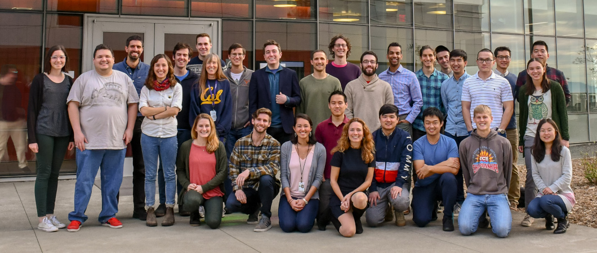

# The Persson Group Handbook

This website serves as the group handbook for the [Persson Group](http://perssongroup.lbl.gov) at the University of California, Berkeley / Lawrence Berkeley National Laboratory. The purpose of this handbook is to provide information to new students and post-docs who do not yet have full access to internal group resources when they first join the group (hence why this handbook is publically available). This handbook is just the starting point to ensure a smoother integration of new group members and an efficient onboarding process.

Our newest group members often have the most valuable insight in improving the onboarding process and where there may be critical gaps in the handbook. While Ann Rutt and Ryan Kingsbury have the ultimate responsibility of overseeing the handbook (in their [group job](../about/group_jobs) capacity as "Onboarding Guides") all Persson Group members are encouraged to contribute to this handbook via the [open-source repo.](https://github.com/perssongroup/handbook)

